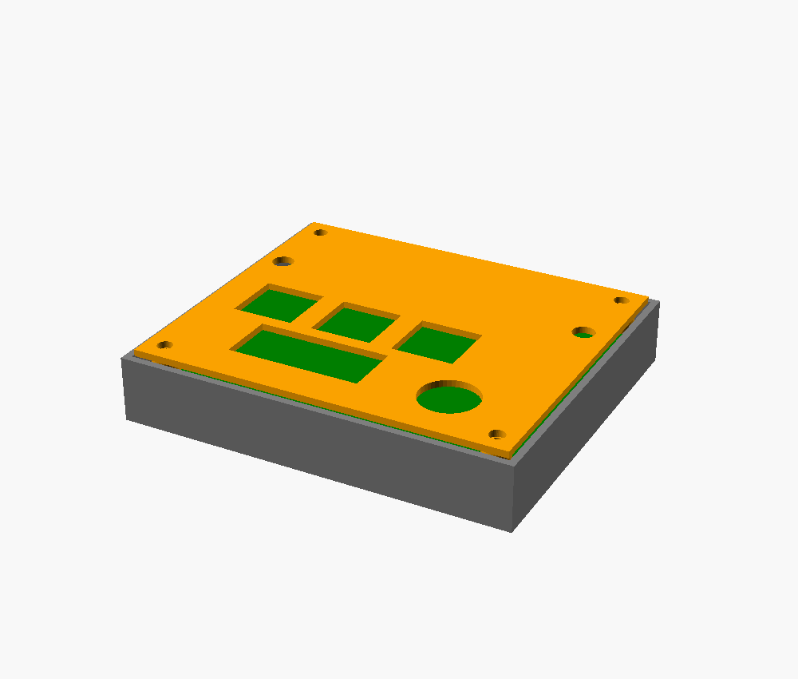
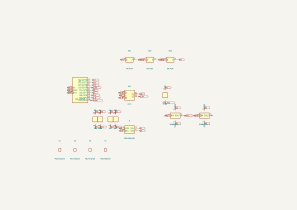
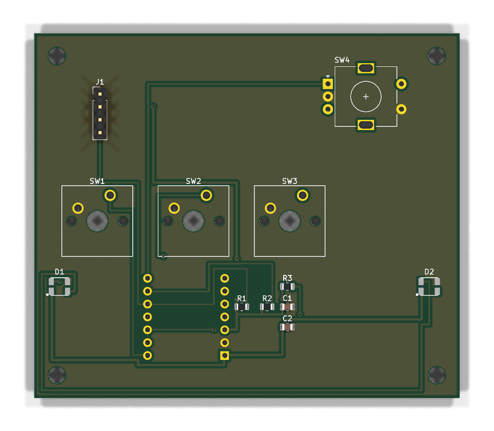
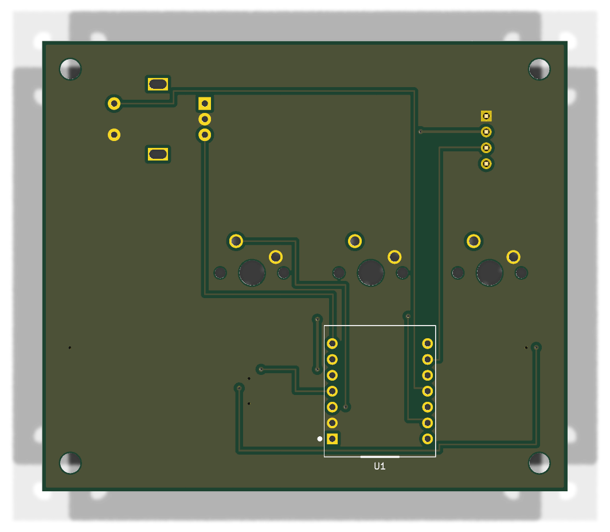

# Focus Totem

A desk totem that runs a Pomodoro/study timer. Twist the encoder to dial in the minutes, press to start, and the two side LEDs breathe along with the session -
amber while setting up, green while the clock is running, red for the last minute, and then a flash when done. The OLED shows the live countdown and where you are (FOCUS / BREAK / DONE).

It's a 4-input hackpad built around a through-hole Seeed XIAO RP2040 and runs QMK, so it doubles as a tiny macropad.



## Controls

| Input          | Does                                  |
|----------------|---------------------------------------|
| Encoder turn   | Set the minutes                       |
| Encoder press  | Start / pause (same as Key 1)         |
| Key 1          | Start / pause                         |
| Key 2          | Hold to reset to the set time         |
| Key 3          | Cycle the short-break preset          |

## Schematic



## PCB

Two-layer, 84 × 72 mm, ground pour both sides, M3 mounting holes in the corners. The XIAO is through-hole and mounts on the **bottom**, so the macropad is assembled from underneath and its USB port lines up with the slot in the case.

| Top | Bottom |
|-----|--------|
|  |  |

## Case

A 3D-printed sandwich: a switch **plate** on top (the switches clip in, the encoder bush and OLED poke through, the side LEDs show through two little windows), the PCB in the middle on 4 mm standoffs, and a **bottom tray** that the XIAO tucks into with a USB slot in the back wall. Four M3 screws come up from underneath into bosses on the plate. Every pocket has 0.4 mm of clearance per side for printing.


## Bill of materials

| Ref      | Part                                   | Notes                        | Qty |
|----------|----------------------------------------|------------------------------|-----|
| U1       | Seeed XIAO RP2040 (through-hole)       | the brains                   | 1   |
| SW1–SW3  | MX-compatible switch                   | the three keys               | 3   |
| SW4      | Alps EC11 rotary encoder (with switch) | dial + push                  | 1   |
| J1       | 0.91" SSD1306 OLED, 128×32, I²C        | 4-pin module                 | 1   |
| D1, D2   | SK6812 MINI-E                          | addressable RGB              | 2   |
| R1, R2   | 4.7 kΩ, 0805                           | I²C pull-ups                 | 2   |
| R3       | 470 Ω, 0805                            | series on the LED data line  | 1   |
| C1       | 100 nF, 0805                           | OLED decoupling              | 1   |
| C2       | 10 µF, 0805                            | LED bulk                     | 1   |
| H1–H4    | M3 × 12 screw                          | sandwich the stack           | 4   |


## Wiring / pinout

| Pad  | RP2040 | Goes to                    |
|------|--------|----------------------------|
| D0   | GP26   | Key 1                      |
| D1   | GP27   | Key 2                      |
| D2   | GP28   | Key 3                      |
| D3   | GP29   | Encoder switch             |
| D4   | GP6    | OLED SDA (I²C1)            |
| D5   | GP7    | OLED SCL (I²C1)            |
| D6   | GP0    | Encoder A                  |
| D7   | GP1    | Encoder B                  |
| D10  | GP3    | SK6812 data in             |
| 5V   | —      | LED V+, C2                 |
| 3V3  | —      | OLED V+, I²C pull-ups, C1  |
| GND  | —      | common ground              |

Each key and the encoder switch pull their pin to ground. The encoder common goes to ground. The LEDs are daisy-chained XIAO → R3 → D1 → D2. The OLED answers on I²C address `0x3C`.

## Repository layout

```
CAD/         case design — focus-totem.scad + the assembled model (.3mf)
PCB/         KiCad project — schematic, routed board, libraries
Firmware/    QMK keyboard (keyboard.json, config.h, rules.mk, keymaps/)
production/  manufacturing files — gerbers.zip, plate + bottom STLs, firmware.uf2
images/      the screenshots above
```

## Firmware — build & flash

The firmware is a QMK keyboard. Drop the `Firmware` folder into a QMK checkout as a keyboard called `focus_totem` and build it:

```sh
# from the root of a qmk_firmware checkout
cp -r Firmware <qmk_firmware>/keyboards/focus_totem
qmk compile -kb focus_totem -km default
```

To flash: plug the XIAO in, double-tap its reset/boot so it mounts as a USB drive, and copy the `.uf2` across. It reboots into the firmware on its own.

## Case — regenerating the model

The case is parametric OpenSCAD, driven off the board outline and the KiCad component positions:

```sh
cd CAD
openscad -D 'part="plate"'    -o ../production/focus-totem-plate.stl  focus-totem.scad
openscad -D 'part="bottom"'   -o ../production/focus-totem-bottom.stl focus-totem.scad
openscad -D 'part="assembly"' -o focus-totem-assembly.3mf            focus-totem.scad
```